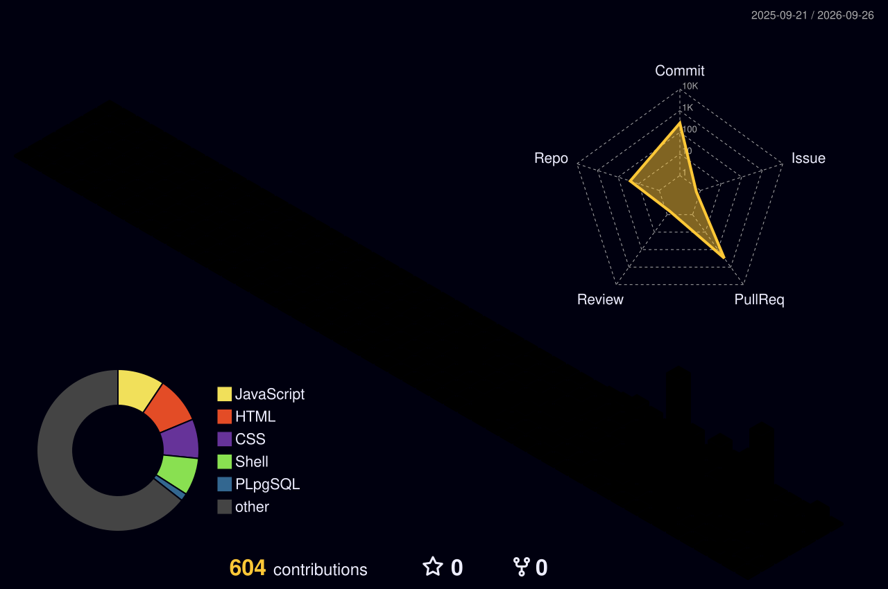

  

  

### Técnico en Desarrollo de Software

Guatemala, Guatemala · Remoto / Híbrido

Desarrollador backend en formación con experiencia práctica construyendo y probando APIs con Strapi y Postman. Actualmente colaboro en un proyecto real de actualización de plataforma y continúo mi formación como Desarrollador FullStack en Campuslands.

 

<h2 align="center">Panel de capacidades</h2>

<table align="center">
  <tr>
    <th align="center">Backend</th>
    <th align="center">Frontend</th>
    <th align="center">Bases de datos</th>
    <th align="center">Automatización</th>
    <th align="center">Herramientas</th>
    <th align="center">Electrónica</th>
  </tr>
  <tr>
    <td align="center">Node.js</td>
    <td align="center">HTML</td>
    <td align="center">MySQL</td>
    <td align="center">n8n</td>
    <td align="center">Git</td>
    <td align="center">Arduino</td>
  </tr>
  <tr>
    <td align="center">JavaScript</td>
    <td align="center">CSS</td>
    <td align="center">PostgreSQL</td>
    <td align="center">Telegram</td>
    <td align="center">GitHub</td>
    <td align="center">HC-SR04</td>
  </tr>
  <tr>
    <td align="center">Strapi</td>
    <td align="center">JavaScript</td>
    <td align="center">—</td>
    <td align="center">Google Sheets</td>
    <td align="center">Docker</td>
    <td align="center">DHT22</td>
  </tr>
  <tr>
    <td align="center">APIs · Postman</td>
    <td align="center">—</td>
    <td align="center">—</td>
    <td align="center">Google AI</td>
    <td align="center">VS Code</td>
    <td align="center">HC-SR501 · LDR</td>
  </tr>
</table>

  

 

  

<strong>En formación:</strong> Python · MySQL · PostgreSQL

## Experiencia y proyectos

| **Actualización de plataforma OMS** | **TutorBot** |
|:---:|:---:|
| Construcción y prueba de APIs con Strapi 5, incluyendo operaciones CRUD completas mediante Postman. Resolución de un bloqueo de entorno migrando la ejecución de Docker a Node.js local.  **Stack:** Strapi 5 · Node.js · Postman · Docker  **Experiencia profesional** | Automatización de tutorías mediante asignación, validación de identidad y notificaciones automáticas al maestro y materia correspondiente.  **Stack:** n8n · Google AI · Google Sheets · Telegram  [Ver proyecto](https://github.com/canuxantonio502/automatizacion_tutorbot_n8n) |
| **Gestión de Parque Vehicular** | **Tienda en línea** |
| Sistema de control de estacionamiento para diferentes tipos de vehículos y gestión de espacios.  **Stack:** HTML · CSS · JavaScript  [Ver proyecto](https://github.com/lemical07/sistema-gestion-parqueo) | Maquetación de una interfaz de tienda online.  **Stack:** HTML · CSS  [Ver proyecto](https://github.com/lemical07/maquetacion-tienda-online) |

<h2 align="center">Formación</h2>

<table>
  <tr>
    <th align="left">Formación académica y complementaria</th>
  </tr>
  <tr>
    <td align="left">
      <strong>Desarrollador FullStack — Campuslands</strong> 
      2026 · Presente
    </td>
  </tr>
  <tr>
    <td align="left">
      <strong>Bachillerato en Ciencias y Letras, Orientación en Electrónica Industrial</strong> 
      2024 · 2025 
      Graduado con honores · Medalla de Oro al mejor promedio de la carrera.
    </td>
  </tr>
  <tr>
    <td align="left">
      <strong>Educación complementaria</strong> 
      Certificaciones INTECAP · Diplomado DIGEEX 
      Electricidad Industrial · Soldadura Industrial · Mecánica Automotriz · Carpintería
    </td>
  </tr>
  <tr>
    <td align="left">
      <strong>Idiomas</strong> 
      Pocomchí — Materno · Inglés — Básico
    </td>
  </tr>
</table>

<h2 align="center">Indicadores</h2>

  

<h2 align="center">Contribuciones</h2>

  

<h2 align="center">Valor profesional</h2>

<table>
  <tr>
    <td align="center">Comunicación directa ante problemas técnicos.</td>
  </tr>
  <tr>
    <td align="center">Iniciativa para proponer alternativas y soluciones.</td>
  </tr>
  <tr>
    <td align="center">Adaptabilidad y capacidad para explicar conocimientos.</td>
  </tr>
  <tr>
    <td align="center">Apertura a la retroalimentación técnica.</td>
  </tr>
  <tr>
    <td align="center">Gestión de prioridades bajo presión.</td>
  </tr>
</table>

<h2 align="center">Contacto</h2>

¿Tienes un proyecto o una oportunidad profesional? Puedes contactarme por cualquiera de estos canales:

  

